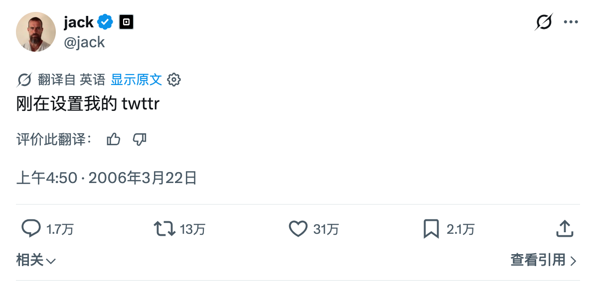

# x-shot

**English** · [简体中文](README.zh-CN.md)

A [Claude Code](https://claude.com/claude-code) skill that screenshots **real X (Twitter) tweets in their native web style** — avatar, verified badge, translation prompt, body text, embedded media, quoted tweets, timestamp and engagement counts — all in one crisp, retina-quality PNG.

It drives **your own logged-in Chrome** through the [opencli](https://github.com/jackwener/opencli) browser bridge, so the capture includes elements that only appear when you're signed in (Subscribe button, view count, translation prompt, etc.). No API keys, no headless login, no cookies to export.

<p align="center">
  
</p>

> Demo: the first tweet ever, captured at 2× via `x-shot`.

## ✨ Features

- **Native look** — captures the actual X web card, not a re-rendered mockup.
- **Logged-in state** — reuses your real Chrome session, so subscribe/views/translation UI show up.
- **Always 2× retina** — short tweets in one shot; long tweets are tiled top-to-bottom and stitched seamlessly.
- **Precise crop** — measures the tweet `<article>` and crops exactly to the card, no manual cropping.
- **Zero third-party deps** — cropping & stitching done with a pure Python-standard-library PNG codec.
- **Handles everything** — text-only, image tweets, quote tweets, and very long threads-in-one-tweet.

## 📋 Requirements

| Dependency | Notes |
|---|---|
| [opencli](https://github.com/jackwener/opencli) | `npm i -g @jackwener/opencli` — provides the browser bridge |
| Chrome + OpenCLI extension | Must be **logged in to x.com** |
| Python 3 | Standard library only — nothing to `pip install` |
| bash | macOS & Linux |

Verify the bridge is live before use:

```bash
opencli doctor
```

You should see `Extension: connected` and at least one profile `connected`.

## 🚀 Install (as a Claude Code skill)

Clone into your Claude Code skills directory as a folder named `x-shot`:

```bash
git clone https://github.com/Eyeseas/x-shot-skill.git ~/.claude/skills/x-shot
chmod +x ~/.claude/skills/x-shot/scripts/*.sh ~/.claude/skills/x-shot/scripts/*.py
```

Then just tell Claude Code:

> 给这条推文截图 https://x.com/jack/status/20

## 🛠 Standalone usage (no Claude)

```bash
bash scripts/xshot.sh "<tweet-url>" [output.png]
```

- `<tweet-url>` — a single-tweet `/status/` link. `x.com`, `twitter.com`, `mobile.x.com` are all normalized to `x.com`.
- `[output.png]` — optional. Defaults to `~/Downloads/x-shot-<timestamp>.png`.
- The final absolute path is printed on the last line of stdout.

Example:

```bash
bash scripts/xshot.sh "https://x.com/jack/status/20" ~/Desktop/tweet.png
```

## ⚙️ How it works

1. `opencli browser open <url>` opens the tweet in your logged-in tab.
2. Waits for `article[data-testid="tweet"]` to render.
3. Neutralizes every `position: fixed/sticky` element → `static`, so X's floating top bar can't occlude scrolled tiles.
4. Measures the tweet card's **document coordinates** plus `innerWidth/innerHeight` via an isolated-scope `eval`.
5. **Tiles at 2×**: scrolls viewport-by-viewport, screenshots each tile, and keeps only the newly revealed slice of the article (deduping the clamped overlap at the bottom). Width never changes, so X's responsive layout never reflows.
6. `scripts/xstitch.py` derives the scale from each tile's real pixel width ÷ `innerWidth`, crops the tweet column, and stitches the slices into one tall PNG.

## ⚠️ Notes & troubleshooting

- **Must be logged in.** Not signed in → the subscribe/views/translation elements are missing, and the tweet may not load at all. A `tweet card did not appear` error usually means you're not logged in, or the URL isn't a single-tweet page.
- The page is temporarily mutated (sticky removed + scrolling) during capture and scrolled back to the top afterward. The live tab's styling is a transient state; a refresh restores it.
- One reused `xshot` session tab — no tab pile-up, login stays warm.
- Only 8-bit RGB/RGBA non-interlaced PNGs are handled (exactly what the browser produces). Safety cap: 40 tiles.

## 📄 License

[MIT](LICENSE) © Eyeseas

---

*This skill only screenshots tweets. To convert a tweet to markdown/text, use a different tool. Respect X's Terms of Service and other people's copyright when sharing captured content.*
